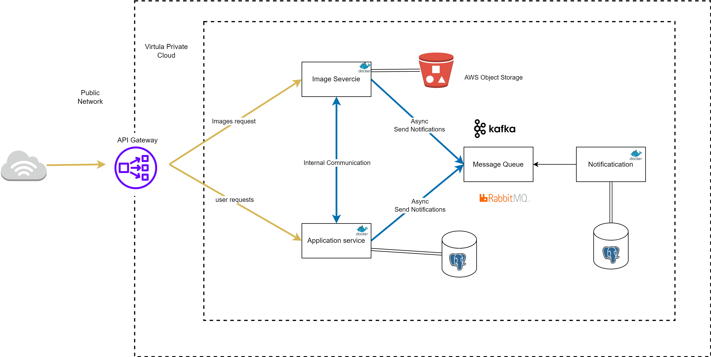
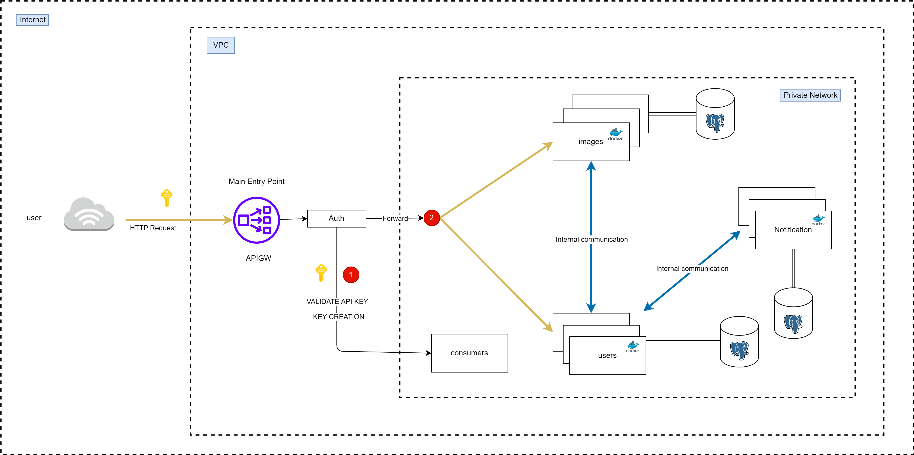
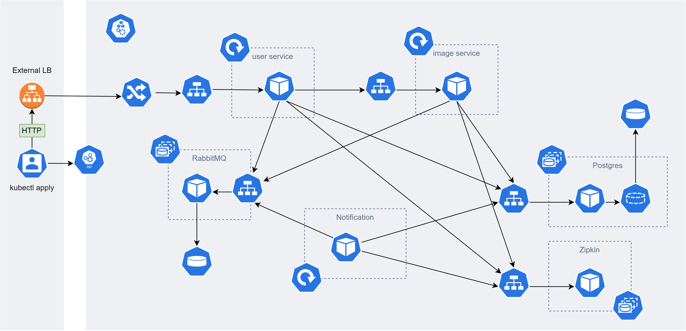

# Image Sharing System

## Main System

The system will be running on AWS since its offers scalable and highly available infrastructure components, such as load balancers, auto-scaling, and managed databases.

System runs inside a Virtula Private Cloud. Request comming form users pass though API gateway this allows for load balancing and will be help full duirng auto scalling.

The API gateway handle authentication once authenticated the requests routed to the services.

## Application / User Service

This handles user data, accounts, profiles, friends lists, inbox and all related objects for the user.

## Asynchronous Processing

Useing Rabbit MQ for handling image processing tasks asynchronously. This helps in offloading time-consuming tasks from the main application server and improves responsiveness.

## Image Service

Process the images before storage. The images are compressed and can be edited with filters, croped and image enhancements utilities.

## Image Storage

Making use of AWS object Storage with lifecycle to archive old images that havent been accesed for a number of days to save on storage costs.

## Data Storage

Usgin AWSRDS for postgress to hande user data. Maged service is earier to scale and maintinance.

## Caching

Redis caching for data which in memory and fast.

## Security

## Users and Consumers

Authentication is handled on the API gateway. Afetr users are authenticated the request is poxyed to the user or image server.

Using JWT tokens for authentication for better security.

AWS shiled for DDOS attacks.

AWS Cloud Front CDN for content delivery. Works on gloabal scale.

## Scalability

Auto-scaling using Amazon Kubernetes Service (Amazon EKS) allows you to automatically adjust the number of pods (containers) in your Kubernetes cluster based on demand. It ensures that your application can handle varying levels of traffic while optimizing resource utilization and cost efficiency.

## Backup and Disaster Recovery

Cross-Region Replication
For more robust disaster recovery, you can set up a backup EKS cluster in a different AWS region. By using tools like AWS CloudFormation, Kubernetes manifests, and container images replication, you can automate the process of creating a replica of your cluster in another region.

